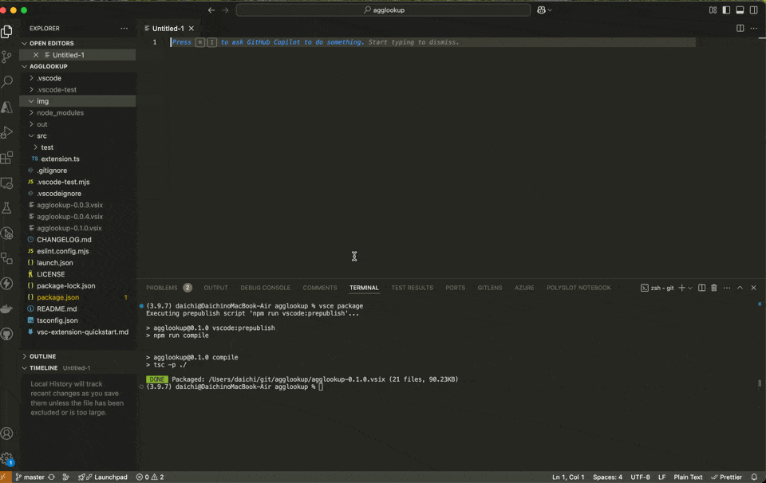

# agglookup README

This extension allows you to look up Pendo aggregation tables by providing keywords.

Build extension using vsce package and install vsix

## Features

- Look up Pendo aggregation tables by entering keywords such as `visitors`, `accounts`, `pages`, etc.
- Displays the table content in a webview panel.
- Provides hover information for keywords in any text document.
- **NEW**: Table definitions now stored in easy-to-edit `tables.json` file (see [TABLES_GUIDE.md](TABLES_GUIDE.md))

Only highlights most common fields.

## Available sources
'visitors'
'accounts'
'pages'
'features'
'trackTypes' 
'guides'
'groups'
'events'
'pageEvents' 
'featureEvents'
'trackEvents'
'guideEvents'
'pollEvents' 
'guidesSeen' 
'pollsSeen'
'singleEvents'
'emailEvents'
## Known Issues

Does not automatically activate. You need to use the command agglookup: show to activate.
Once activated it will stay activated on all files.
TODO: fix activation

## Updating Table Definitions

Table definitions are now stored in `tables.json` for easy editing. See [TABLES_GUIDE.md](TABLES_GUIDE.md) for detailed instructions on how to add, update, or remove table definitions.

## Release Notes

### 1.0.0

- Refactored table definitions to use external JSON file for better scalability and maintainability
- Table definitions now human-friendly and easy to update without code changes
- Added comprehensive guide for managing table definitions

### 0.1.1

added fields to some sources

## License

This project is licensed under the MIT License - see the [LICENSE](LICENSE) file for details.

